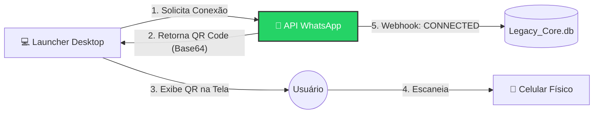

# 📱 Legacy Nexus - Módulo CRM & Conectividade

> **Nota:** Este documento refere-se especificamente ao subsistema de comunicação e gestão de leads (CRM). Para o robô de extração, consulte o [README Principal](./README.md).

## 🎯 Objetivo do Módulo
Transformar os dados brutos extraídos (Tabela SQL) em ações de vendas reais.
O sistema deixa de ser apenas um "leitor de dados" e passa a atuar ativamente na **Notificação e Conversão de Clientes**.

---

## 🔌 Fase 1: O Sistema de Conexão (Handshake)

Nesta etapa inicial, o foco é estabelecer uma ponte segura e estável entre o **Legacy Nexus Desktop** e os servidores do WhatsApp.

### 🛠️ Arquitetura de Conexão
O sistema não utiliza automação de tela (Selenium) para o WhatsApp, pois isso é instável. Utilizamos comunicação via **API REST** (Ex: Evolution API / WPPConnect) rodando em container ou nuvem.

