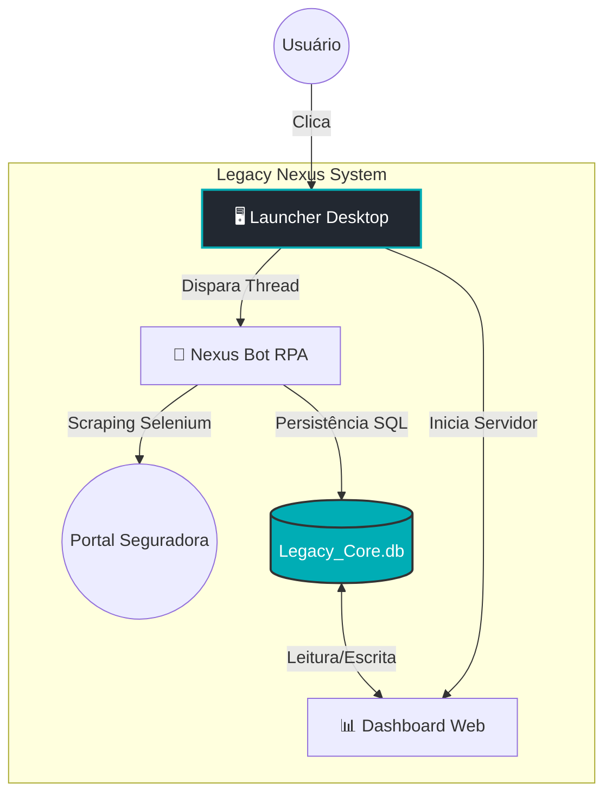
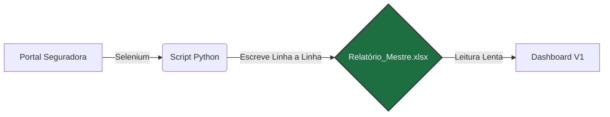
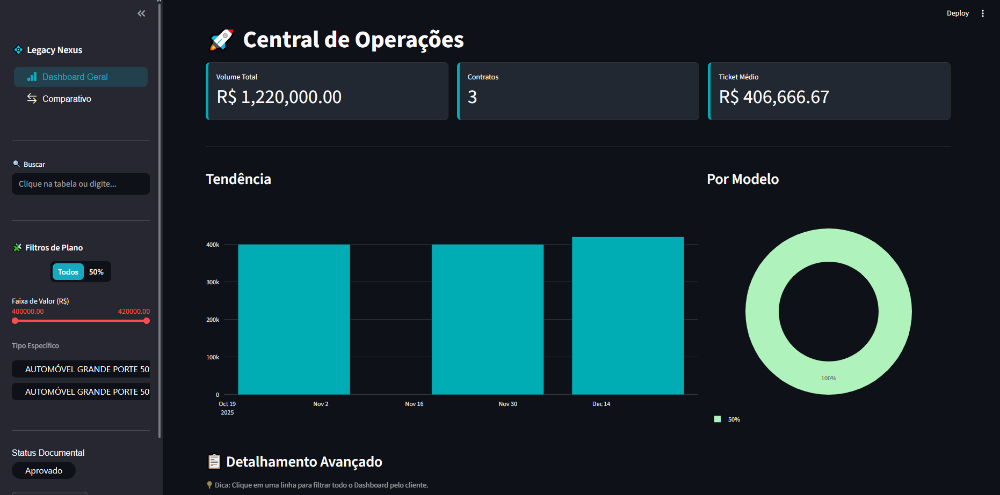
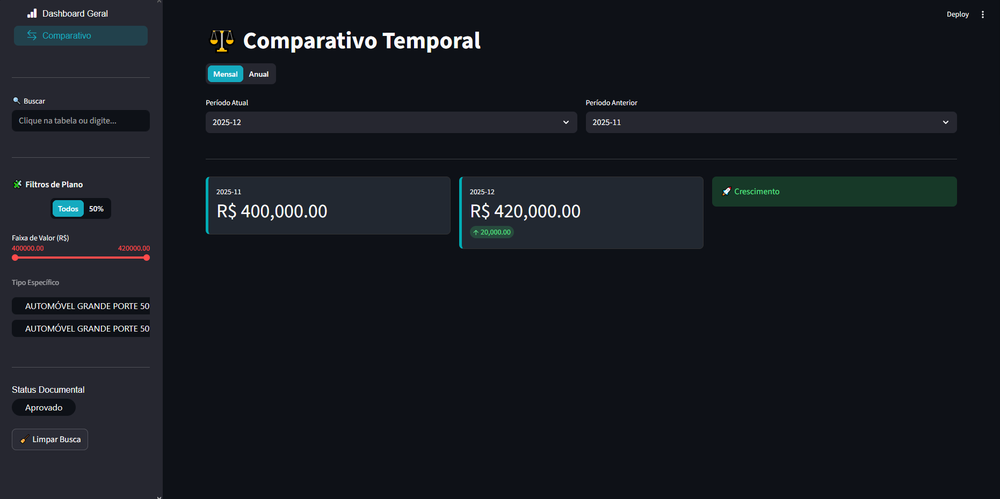

# 🚀 Legacy Nexus - Ecossistema de Inteligência Comercial

> **Nota:** Este é um repositório de demonstração (Showcase). O código-fonte original é mantido em repositório privado para proteção de regras de negócio.

## 📋 Sobre o Projeto
O **Legacy Nexus** evoluiu de uma automação simples para uma **Central de Operações (Command Center)** completa para gestão de consórcios.

O sistema elimina o trabalho manual de verificar portais de seguradoras, extraindo dados automaticamente e transformando-os em inteligência de negócios. A versão 2.0 introduz uma interface desktop (Launcher), persistência em banco de dados relacional e um Dashboard interativo com design de alta fidelidade.

## ⚙️ Arquitetura da Solução (V2.0 - Atual)

O sistema abandonou planilhas (`.xlsx`) em favor de uma arquitetura robusta baseada em Banco de Dados e Interface Gráfica Dedicada:

## 📜 Evolução da Arquitetura (Histórico)

O projeto sofreu uma refatoração completa para garantir escalabilidade e segurança de dados. Abaixo, o comparativo entre a abordagem inicial e a solução atual.

### ❌ Versão Legada (V1.0 - Baseada em Arquivo)
Na primeira versão, o sistema utilizava planilhas Excel como banco de dados.
* **Problema:** Conflitos de I/O (o robô não conseguia salvar se o Dashboard estivesse lendo o arquivo).
* **Interface:** Execução via linha de comando (terminal).

## 📸 Demonstração

Confira o **Legacy Nexus** em ação: o robô realizando a extração e o Dashboard atualizando em tempo real.

https://github.com/user-attachments/assets/b2042647-fa48-4663-93f3-3fd0cf15471c

[]

[]

## 🛠️ Stack Tecnológica

    - Core: Python 3.12

    - Interface Desktop (GUI): CustomTkinter

    - Automação Web: Selenium WebDriver

    - Banco de Dados: SQLite3 (Migrado do Excel)

    - BI & Frontend: Streamlit + Streamlit Antd Components (SAC)

    - Visualização de Dados: Plotly Express

## 📅 Roadmap e Atualizações

Acompanhe a evolução técnica detalhada no [DEVLOG.md](./DEVLOG.md).

- [x] **Fase 1:** Extração de dados automatizada (RPA)

- [x] **Fase 2:** Migração de Excel para Banco de Dados SQL (Performance)

- [x] **Fase 3:** Refatoração de UI/UX (Design System Dark/Neon)

- [ ] **Fase 4:** Criação do Launcher Desktop (Central de Comando)

- [ ] **Futuro:** Criação de leads para whatsapp.

