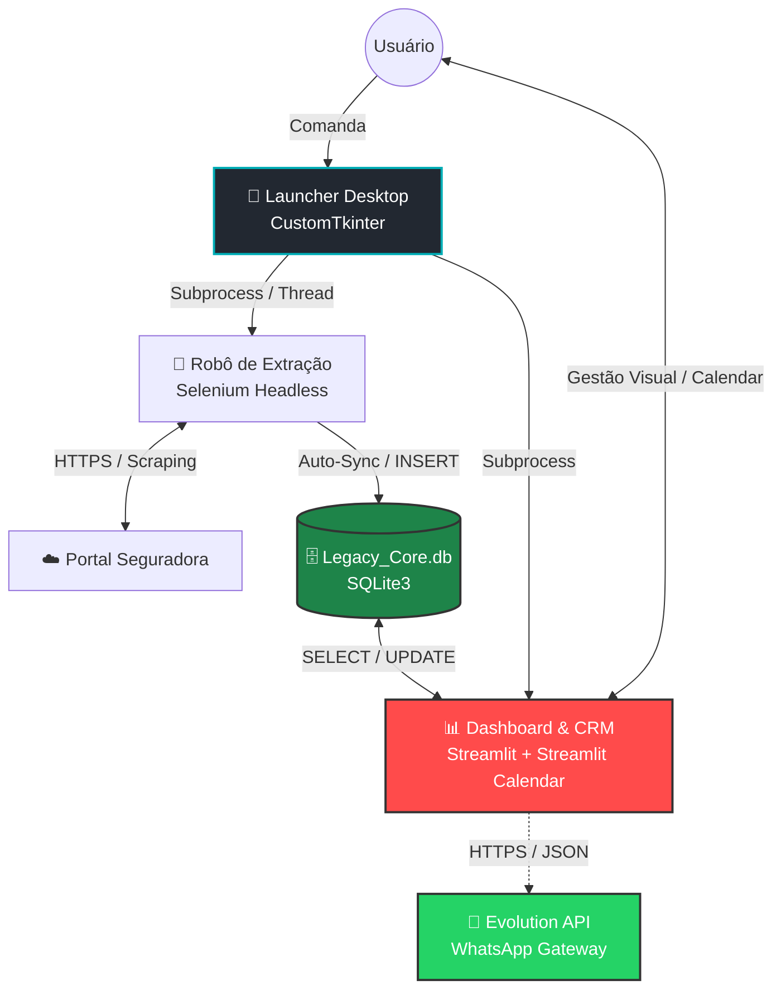
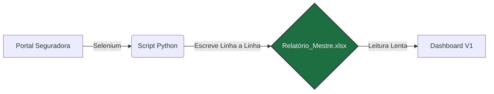

# 🚀 Legacy Nexus - Ecossistema de Inteligência Comercial

> **Nota:** Este é um repositório de demonstração (Showcase). O código-fonte original é mantido em repositório privado para proteção de regras de negócio.

## 📋 Sobre o Projeto

O **Legacy Nexus** evoluiu de uma simples automação de tarefas para uma **Central de Operações (Command Center)** completa e integrada para gestão de consórcios.

O sistema atua como um "funcionário digital", eliminando o trabalho manual de verificar portais de seguradoras. Ele extrai dados automaticamente, valida duplicidades e os transforma em **Inteligência de Negócios (BI)** acionável.

## ⚙️ Arquitetura da Solução (V2.2 - Nexus Ecosystem)

O projeto evoluiu de um script linear para um **Ecossistema Integrado**. O **Launcher** continua orquestrando os processos, mas agora o fluxo de dados suporta operações de **CRM Tático** (Gestão) e **Mensageria Automatizada**, transformando o banco de dados em um hub central de leitura e escrita.

### 🧩 Diagrama de Componentes

## 📜 Evolução da Arquitetura (Histórico)

O projeto sofreu uma refatoração completa para garantir escalabilidade e segurança de dados. Abaixo, o comparativo entre a abordagem inicial e a solução atual.

### ❌ Versão Legada (V1.0 - Baseada em Arquivo)
Na primeira versão, o sistema utilizava planilhas Excel como banco de dados.
* **Problema:** Conflitos de I/O (o robô não conseguia salvar se o Dashboard estivesse lendo o arquivo).
* **Interface:** Execução via linha de comando (terminal).

## 📸 Demonstração

Confira o **Legacy Nexus** em ação: o robô realizando a extração e o Dashboard atualizando em tempo real.

https://github.com/user-attachments/assets/0f72fc10-b327-4e1f-bf03-47ac07802bea

https://github.com/user-attachments/assets/e649cc8a-1a09-47e1-8c85-c22ac06c5e75

https://github.com/user-attachments/assets/41918dc6-349c-42a0-9352-748599fcb6b3

## 🛠️ Stack Tecnológica

    - Core: Python 3.12

    - Interface Desktop (GUI): CustomTkinter

    - Automação Web: Selenium WebDriver

    - Banco de Dados: SQLite3 (Migrado do Excel)

    - BI & Frontend: Streamlit + Streamlit Antd Components (SAC)

    - Visualização de Dados: Plotly Express

## 📅 Roadmap e Atualizações

Acompanhe a evolução técnica detalhada no [DEVLOG.md](./DEVLOG.md).

- [x] **Fase 1:** Extração de dados automatizada (RPA)

- [x] **Fase 2:** Migração de Excel para Banco de Dados SQL (Performance)

- [x] **Fase 3:** Refatoração de UI/UX (Design System Dark/Neon)

- [x] **Fase 4:** Criação do Launcher Desktop (Central de Comando)

- [x] **Fase 5:** Módulo CRM & Inteligência de Funil 

- [x] **Fase 6:** Integração WhatsApp API

- [ ] **Fase 7** Aprimoramento de interface e adições de funcionalidades.

