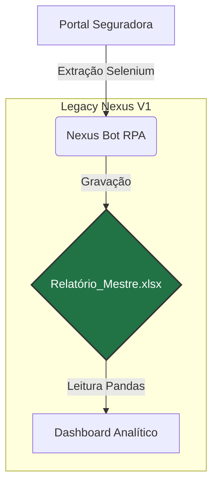
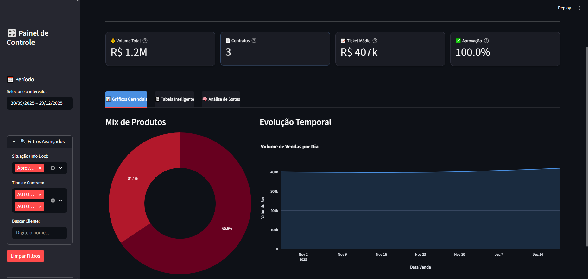

# 🚀 Legacy Nexus - Ecossistema de Inteligência Comercial

> **Nota:** Este é um repositório de demonstração (Showcase). O código-fonte original é mantido em repositório privado.

## 📋 Sobre o Projeto
O **Legacy Nexus** é uma solução de automação (RPA) e Dashboard desenvolvida para otimizar a gestão de consórcios.

O sistema elimina o trabalho manual de verificar o portal da seguradora linha por linha. Um robô inteligente extrai os dados, consolida em relatórios gerenciais e alimenta um painel visual para tomada de decisão rápida.

## ⚙️ Arquitetura da Solução (V1.0)

Atualmente, o sistema opera utilizando arquivos locais estruturados para persistência rápida de dados:

## 📸 Demonstração

Confira o **Legacy Nexus** em ação: o robô realizando a extração e o Dashboard atualizando em tempo real.

[]

[[Analise de Dados](./prints/analise_de_Dados_beta.png)]

[[Tabela Inteligente](./prints/tabela_inteligente_beta.png)]

## 🛠️ Stack Tecnológica

    - Linguagem: Python 3.12

    - Automação Web: Selenium WebDriver

    - Processamento de Dados: Pandas & OpenPyXL

    - Armazenamento: Microsoft Excel (.xlsx)

    - Visualização: Streamlit

## 📅 Roadmap e Atualizações

Acompanhe os detalhes técnicos da evolução do projeto no DEVLOG.md.

- [x] Extração de dados automatizada (RPA)

- [x] Geração de relatórios em Excel

- [x] Dashboard básico

- [ ] Migração para Banco de Dados SQL (Em planejamento para resolver conflitos de I/O)

- [ ] Integração com WhatsApp

